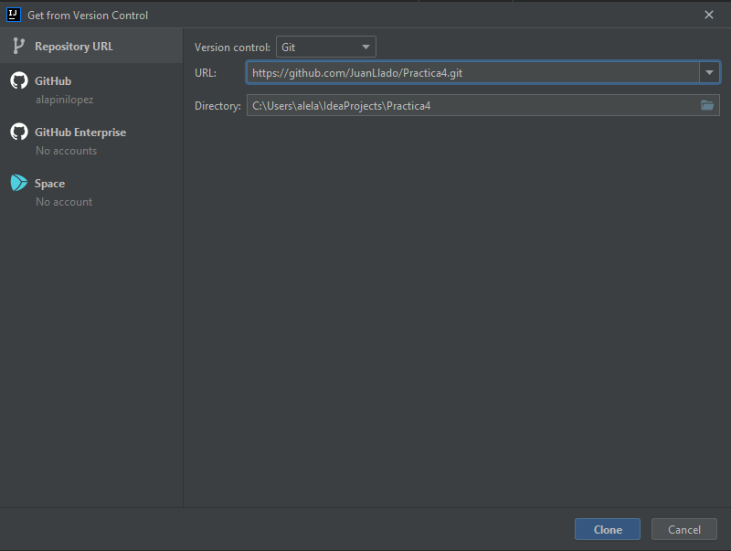
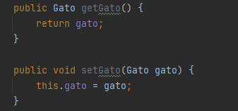
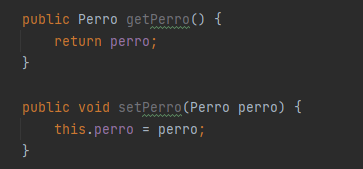
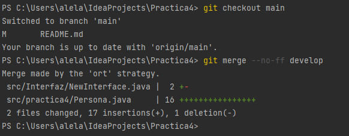
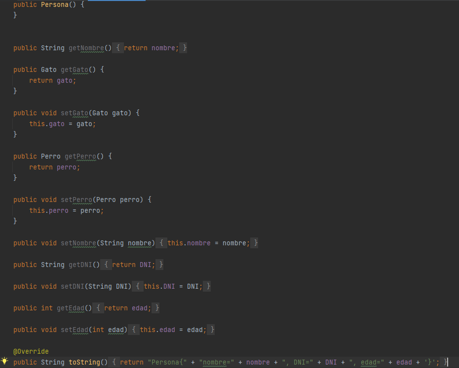
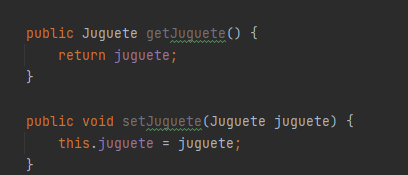
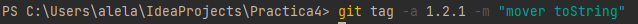
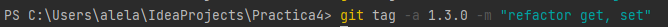
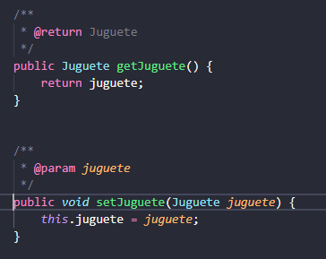

# Práctica 4 
ED4: **Lapini Alessandro, Serra Josep** 

Práctica realizada por Alessandro Lapini y Josep Serra, alumnos de 1º DAW DUAL.

Paso 1: Hacemos un fork del proyecto original.

Paso 2: clonamos el repositorio en nuestro PC.



Paso 3: Modificamos el tag de la rama main a 1.0.0
Para hacerlo primero borramos el actual tag y lo hemos vuelto a crear con los siguientes comandos.
``` 
git tag -d 1.0.0
```
``` 
git tag -a 1.0.0 -m "tag inicial"  a76e6f9 
```

Paso 4: creamos la rama **develop** para trabajar ahí. Luego fusionaremos esta rama a la principal.

``` 
git checkout -b develop
```

Paso 5: hacemos dos refactorizaciones. Nosotros hemos refactorizado la persona, añadiéndole getters y setters a perro y gato.





Paso 6: actualizamos la versión a 1.1.0 y fusionamos la rama




Paso 7: hacemos otras dos refactorizaciones. En la clase persona movemos el *toString* al final del código. Y modificamos los getters
y setters de **juguete** en la clase Niño para mejorar su legibilidad.
que los getters y los setters sean claros, más legibles.



**Niño**



Paso 8: modificamos lasa versiones por cada refator. El refactor del toString lo consideramos un parche, así 
que la versión es 1.2.1



El segundo refactor lo consideramos un cambio menor, ya que refactorizamos el get y el set juguete de la clase **Niño**. Así que la versión establecida pasa a ser 1.3.0



Paso 9: fusionamos la rama develop a la main con los cambios realizados.

````
git merge --no-ff develop
````

# JavaDoc

Para realizar los comentarios en javaDoc he instalado una extension llamada __Javadoc Tools__:



